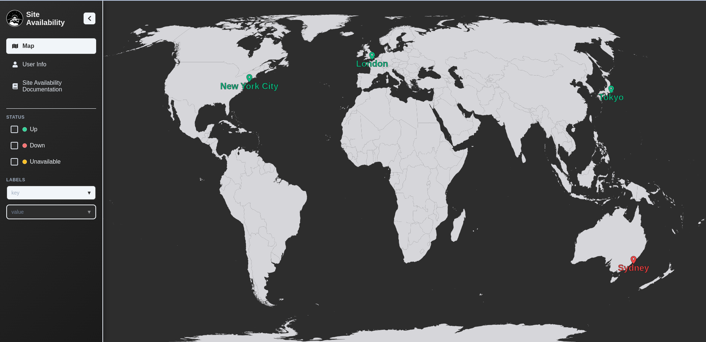

# Quick Start

Get Site Availability Monitoring up and running in under 5 minutes!

## Prerequisites

Before you begin, ensure you have:

- **Docker** and **Docker Compose** installed

## Using Docker Compose

The fastest way to get started is using Docker Compose, which includes the complete stack with Prometheus.

### 1. Create Configuration Files

First, create the necessary configuration files in your project directory:

#### Create `config.yaml`

This file defines your monitoring setup, including locations, sources, and scraping settings:

```yaml
server_settings:
  port: 8080
  sync_enable: false
  labels:
    environment: "development"
    region: "local"

scraping:
  interval: "30s"
  timeout: "5s"
  max_parallel: 10

documentation:
  title: "Site Availability Documentation"
  url: "https://levy-tal.github.io/site-availability/"

locations:
  - name: New York City
    latitude: 40.712776
    longitude: -74.005974
  - name: London
    latitude: 51.507351
    longitude: -0.127758
  - name: Tokyo
    latitude: 35.6762
    longitude: 139.6503
  - name: Sydney
    latitude: -33.8688
    longitude: 151.2093

sources:
  - name: prometheus-main
    type: prometheus
    labels:
      service: "metric-monitoring"
      tier: "backend"
    config:
      url: http://prometheus:9090
      apps:
        - name: myApp
          location: London
          metric: up{instance="app:8080", job="app"}
          labels:
            app_type: "web-service"
            importance: "medium"
        - name: myPrometheus
          location: New York City
          metric: up{instance="localhost:9090", job="prometheus"}
          labels:
            app_type: "prometheus"
            importance: "low"
  - name: basic-http
    type: http
    labels:
      service: "web-monitoring"
      tier: "frontend"
    config:
      apps:
        - name: google
          location: Tokyo
          url: "https://www.google.com"
          ssl_verify: false
        - name: github
          location: Sydney
          url: "https://www.github.com"
```

#### Create `prometheus.yml`

This file configures Prometheus to scrape metrics from your applications:

```yaml
global:
  scrape_interval: 15s
  evaluation_interval: 15s

scrape_configs:
  # Scrape Prometheus itself
  - job_name: "prometheus"
    static_configs:
      - targets: ["localhost:9090"]

  # Scrape your application
  - job_name: "app"
    static_configs:
      - targets: ["app:8080"]
```

### 2. Create Docker Compose File

Create `docker-compose.yaml` to orchestrate all services:

```yaml
services:
  app:
    image: levytal/site-availability:latest
    environment:
      - CONFIG_FILE=/app/config.yaml
    volumes:
      - ./config.yaml:/app/config.yaml
    ports:
      - "8080:8080"
    depends_on:
      - prometheus

  prometheus:
    image: prom/prometheus:latest
    container_name: prometheus
    volumes:
      - ./prometheus.yml:/etc/prometheus/prometheus.yml
    expose:
      - "9090"
```

### 3. Run the Application

Now that you have all three files in your directory:

1. `config.yaml` - Site Availability configuration
2. `prometheus.yml` - Prometheus configuration
3. `docker-compose.yaml` - Docker orchestration

Start the application:

```bash
docker compose up -d
```

### 4. Access the Application

Once the containers are running, you can access:

- **Frontend**: http://localhost:8080 (Site Availability web interface)
- **Prometheus**: http://localhost:9090 (Prometheus metrics UI)



_The Site Availability web interface showing the interactive world map with monitored applications._

## Understanding the Setup

### What Gets Monitored

The default configuration monitors:

1. **Prometheus Targets**: Applications exposing Prometheus metrics
2. **HTTP Endpoints**: Web services and APIs

### Key Features Available

- **Real-time Status**: Live updates every 30 seconds
- **Geographic Visualization**: Apps displayed on world map
- **Label Filtering**: Organize apps by environment, AZ, team, etc.
- **Multiple Sources**: Support for Prometheus, HTTP, and custom sources
- **Metrics Export**: Prometheus-compatible metrics endpoint

### Configuration Explained

- **`server_settings`**: Backend server configuration
- **`scraping`**: How often to collect metrics and timeout settings
- **`locations`**: Geographic locations for monitoring visualization
- **`sources`**: Data sources (Prometheus, HTTP endpoints, site...)
- **`apps`**: Individual applications to monitor within each source

## Troubleshooting

### Services Not Starting?

```bash
# Check Docker containers
docker ps

# View logs
docker logs <app-container-name>
docker logs <prometheus-container-name>

# Check for port conflicts
lsof -i :8080
lsof -i :9090
```

### Can't Access the Application?

- Ensure port 8080 is not in use: `lsof -i :8080`
- Check firewall settings
- Try accessing via `127.0.0.1:8080` instead of `localhost:8080`
- Verify Docker containers are running: `docker-compose ps`

### No Data Showing?

1. **Check Prometheus**: Visit http://localhost:9090/targets
2. **Verify Configuration**: Check your `config.yaml` file
3. **Check Logs**: `docker-compose logs app`
4. **Test API**: `curl http://localhost:8080/api/apps`

### Common Issues

**Port Already in Use:**

```bash
# Find process using port
lsof -i :8080
# Kill process or change port in config
```
